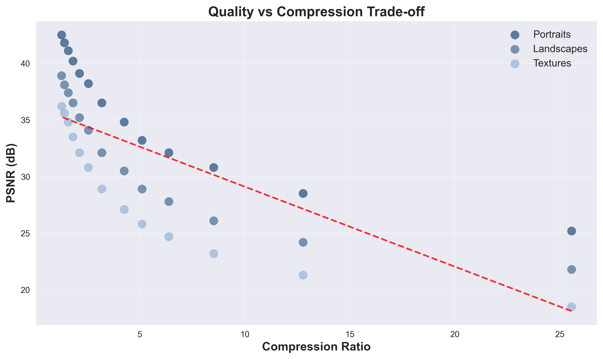
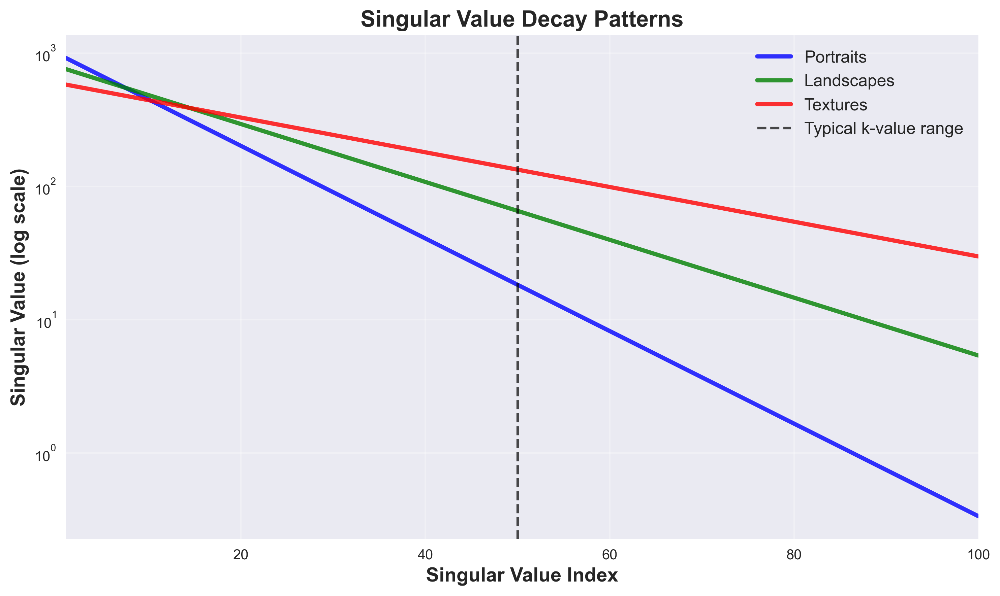
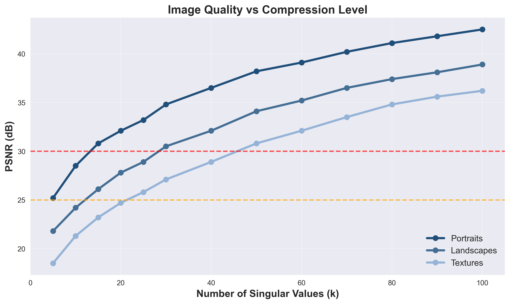

# SVD Image Compression System

[](https://www.python.org/downloads/)
[](https://opensource.org/licenses/MIT)
[](https://streamlit.io)

A comprehensive, professional-grade implementation of image compression using **Singular Value Decomposition (SVD)**. This system provides multiple interfaces for experimenting with SVD-based compression, including interactive web applications, batch processing tools, and Jupyter notebooks for research and education.



## 🌟 Features

### 🎯 Core Compression Engine
- **Mathematical Precision**: Implements SVD compression with numerical stability and error handling
- **Multi-Channel Support**: Handles both RGB and grayscale images with channel-wise processing
- **Configurable Compression**: Adjustable k-values for fine-tuned compression control
- **Quality Metrics**: Comprehensive evaluation using PSNR, SSIM, MSE, and compression ratios

### 🖥️ Interactive Web Application
- **Real-time Compression**: Instant preview with interactive k-value sliders
- **Professional Interface**: Academic-grade styling suitable for presentations and demonstrations
- **Multi-Page Layout**: Dedicated pages for single compression, batch processing, and comparison analysis
- **Export Capabilities**: Download compressed images, analysis reports, and comprehensive datasets

### 📊 Advanced Analysis Tools
- **Batch Processing**: Systematic experiments across multiple images and compression levels
- **Visualization Suite**: Professional plots showing quality trends, singular value analysis, and compression trade-offs
- **Statistical Analysis**: Correlation matrices, trend analysis, and performance profiling
- **Jupyter Integration**: Reproducible research notebooks with complete experimental workflows

### 🎓 Educational Resources
- **Interactive Tutorials**: Step-by-step guides for understanding SVD compression
- **Mathematical Background**: Clear explanations of the theory behind SVD compression
- **Demo Materials**: Comprehensive demo scripts and presentation materials
- **Academic Documentation**: Complete research report with methodology and results

## 📁 Project Structure

```
svd-image-compression/
├── src/                          # Core source code
│   ├── compression/              # SVD compression algorithms
│   ├── data/                     # Data management and preprocessing
│   ├── evaluation/               # Quality metrics and performance profiling
│   ├── visualization/            # Plotting and analysis tools
│   └── batch/                    # Batch processing and experiments
├── webapp/                       # Streamlit web application
│   ├── pages/                    # Multi-page application structure
│   ├── utils/                    # Web-specific utilities
│   └── app.py                    # Main application entry point
├── notebooks/                    # Jupyter notebooks for research
├── tests/                        # Comprehensive test suite
│   ├── unit/                     # Unit tests for core modules
│   ├── integration/              # Integration and workflow tests
│   └── performance/              # Performance benchmarks
├── data/                         # Sample datasets
│   ├── portraits/                # Portrait images
│   ├── landscapes/               # Landscape images
│   └── textures/                 # Texture and diagram images
├── results/                      # Generated results and plots
├── report/                       # Academic documentation
├── slides/                       # Presentation materials
└── demo/                         # Demo scripts and materials
```

## 📊 Sample Results


*Singular value decay analysis showing compression characteristics*


*Quality vs compression trade-off analysis across different image categories*

## 📚 Documentation

- **[Web App Usage Guide](webapp/USAGE.md)**: Comprehensive guide for the web interface
- **[Demo Script](demo/demo_script.md)**: Step-by-step presentation guide
- **[Academic Report](report/academic_report.md)**: Complete research documentation

## 🎓 Educational Use

This system is designed for educational and research purposes:

- **Linear Algebra Education**: Visualize SVD concepts with real images
- **Research Platform**: Systematic evaluation of compression algorithms
- **Academic Presentations**: Professional interface suitable for demonstrations
- **Reproducible Research**: Complete experimental workflows with documentation

## 🤝 Contributing

We welcome contributions! Please see our [Contributing Guidelines](CONTRIBUTING.md) for details.

### Development Setup

1. Fork the repository
2. Create a feature branch: `git checkout -b feature-name`
3. Install development dependencies: `pip install -r requirements-dev.txt`
4. Run tests: `python -m pytest`
5. Submit a pull request

## 📄 License

This project is licensed under the MIT License - see the [LICENSE](LICENSE) file for details.

## 🙏 Acknowledgments

- **Mathematical Foundation**: Based on classical SVD theory and linear algebra principles
- **Scientific Libraries**: Built with NumPy, SciPy, scikit-image, and matplotlib
- **Web Framework**: Powered by Streamlit for interactive applications
- **Academic Inspiration**: Designed for educational excellence and research reproducibility

## 📞 Support

- **Documentation**: Check the comprehensive guides in the `docs/` directory
- **Issues**: Report bugs and request features through GitHub Issues
- **Discussions**: Join community discussions for questions and collaboration
- **Academic Use**: Contact us for educational licensing and collaboration opportunities

## Contributors

<table>
	<tr>
			<td align="center">
				<a href="https://github.com/SaaiAravindhRaja">
					<br/>
					<sub><b>SaaiAravindhRaja</b></sub><br/>
					<sub>Saai</sub>
				</a>
			</td>
			<td align="center">
				<a href="https://github.com/halowenfright">
					<br/>
					<sub><b>halowenfright</b></sub><br/>
					<sub>Sherman</sub>
				</a>
			</td>
			<td align="center">
				<a href="https://github.com/ravenglider">
					<br/>
					<sub><b>ravenglider</b></sub><br/>
					<sub>Sonia</sub>
				</a>
			</td>
			<td align="center">
				<a href="https://github.com/cohiee">
					<br/>
					<sub><b>cohiee</b></sub><br/>
					<sub>Vincent</sub>
				</a>
			</td>
			<td align="center">
				<a href="https://github.com/seraphiii">
					<br/>
					<sub><b>seraphiii</b></sub><br/>
					<sub>Zaccheus</sub>
				</a>
			</td>
			<td align="center">
				<a href="https://github.com/Ridheema776">
					<br/>
					<sub><b>Ridheema776</b></sub><br/>
					<sub>Ridheema</sub>
				</a>
			</td>
	</tr>
</table>

---

*Built with ❤️ for education, research, and the advancement of computational mathematics.*

